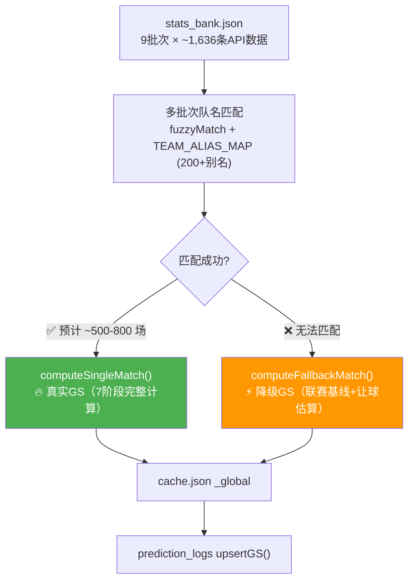
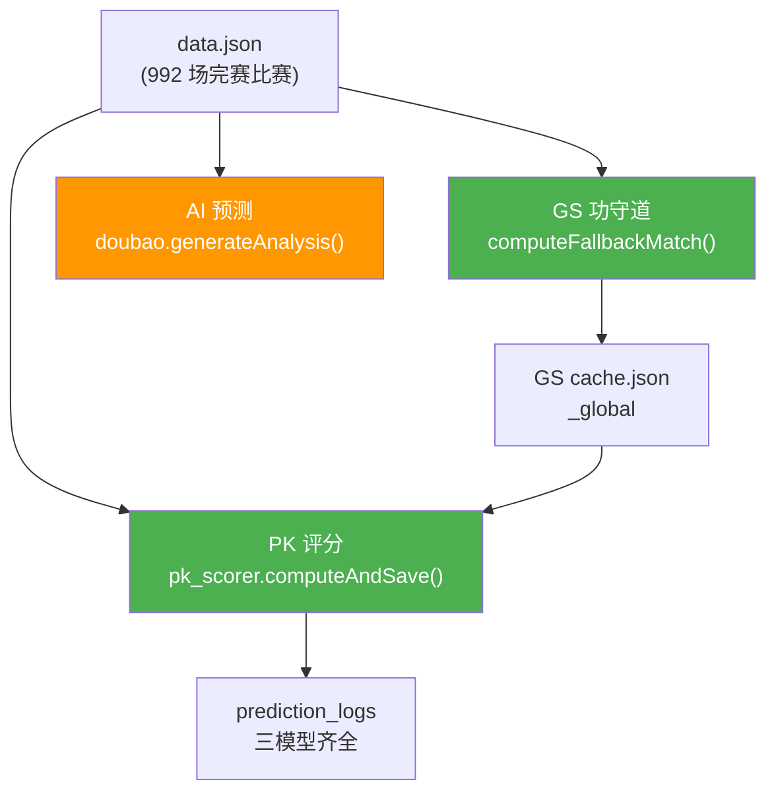
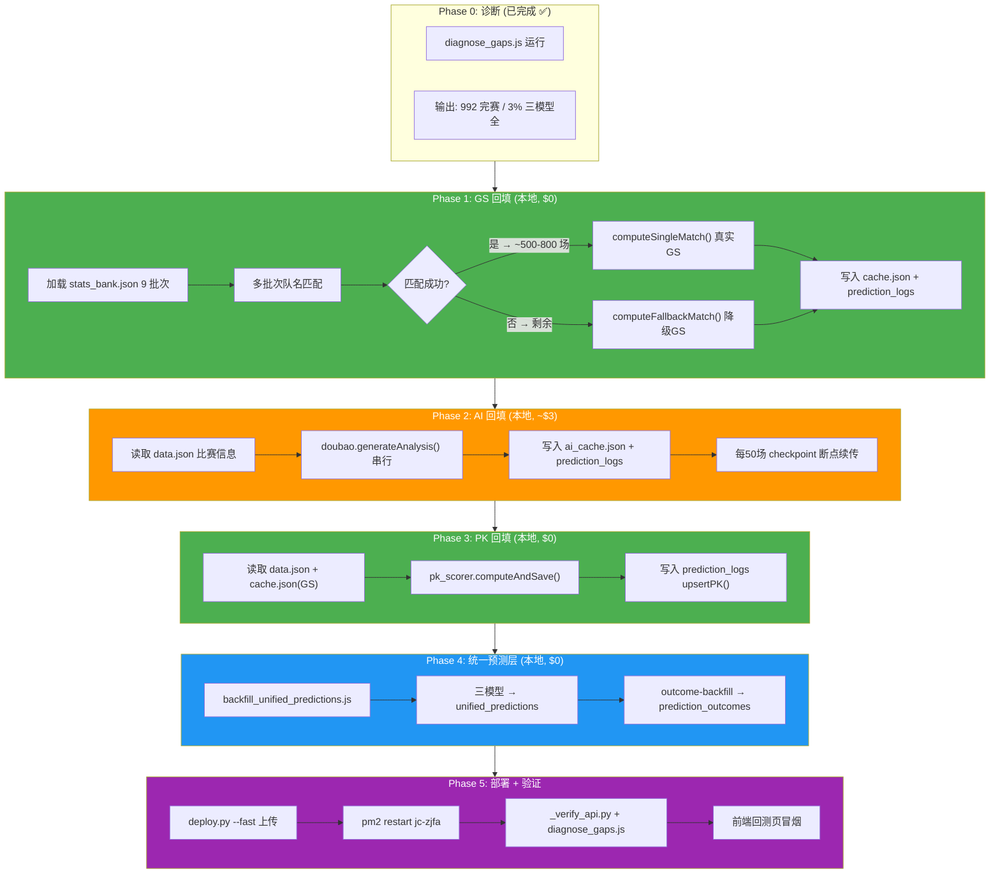

# 数据勘误与模型数据补全 — 完整回填计划 v3.0

> 2026-03-19 至 2026-06-06 期间的功守道、PK、AI 三模型数据全覆盖回填方案。
>
> 本文档整合了多轮讨论的全部发现：数据全景诊断、缺口分析、可行性评估、安全策略、阶梯式 GS 策略、全流程执行计划。

---

## 目录

1. [诊断结果——当前数据全景](#1-诊断结果当前数据全景)
2. [stats_bank.json 缓存宝藏](#2-stats_bankjson-缓存宝藏)
3. [三模型可行性分析](#3-三模型可行性分析)
4. [依赖链与流程图](#4-依赖链与流程图)
5. [安全策略](#5-安全策略)
6. [六阶段执行计划](#6-六阶段执行计划)
7. [现有回填脚本全景](#7-现有回填脚本全景)
8. [关键模块 API 详解](#8-关键模块-api-详解)
9. [核心算法细节](#9-核心算法细节)
10. [部署与验证流程](#10-部署与验证流程)
11. [涉及文件清单](#11-涉及文件清单)

---

## 1. 诊断结果——当前数据全景

### 1.1 运行诊断

```bash
node server/diagnose_gaps.js
```

### 1.2 核心发现

| 指标 | 值 | 状态 |
|------|-----|------|
| data.json 总场次 | 1,044 场 | - |
| 3/19~6/6 完赛且有比分 | **992 场**（72 天） | ✅ 赛果完整 |
| AI 缓存 | **60 keys**，仅命中 36 场 | ❌ 覆盖率 4% |
| GS 缓存 | **129 keys**，仅命中 99 场 | ❌ 覆盖率 10% |
| PK 预测写入 | 87 条 | ❌ 覆盖率 9% |
| **三模型齐全** | **仅 30 场（3%）** | 🔴 严重不足 |
| **三模型全空** | **887 场** | 🔴 需补全 |
| 赛果覆盖率 | 100%（992/992） | ✅ |
| sporttery_odds_snapshot | 90,744 条（8,454 场） | ✅ 桥接已完成 |
| sporttery_preview | 6,805 条（6,805 场） | ✅ 桥接已完成 |

### 1.3 按日缺口矩阵（摘要）

```
◇ 2026-03-19  F=8   A=✓   AI=-2  GS=-5  PK=-3  齐=-5
◇ 2026-03-22  F=15  A=✓   AI=-3  GS=-10 PK=-4  齐=-10
◆ 2026-05-29  F=12  A=✓   AI=✓  GS=✓   PK=✓   齐=✓   ← 唯一无缺口日
```

- **有缺口的天数：71/72 天**
- 仅 2026-05-29 三模型全覆盖

### 1.4 数据层次全景

```
┌─────────────────────────────────────────────────────────────────┐
│                        数据层次关系                              │
├─────────────────────────────────────────────────────────────────┤
│                                                                 │
│  L0: data.json (992 完赛比赛, 3/19-6/6)                        │
│       ├─ matchStatus=2 + score 有效 → 可作为回测基准           │
│       └─ 含 matchId / homeName / visitName / leagueName / date │
│                                                                 │
│  L1: stats_bank.json (~1,636 条 API 原始数据)                  │
│       ├─ 9 个有效批次 (_raw_26051 ~ _raw_26061)                │
│       ├─ 含实力分/进球分布/交锋等 60+ 字段/场                    │
│       └─ ★ 核心价值: 可喂给功守道 7 段管道算真实 GS             │
│                                                                 │
│  L2: ai_cache.json (DeepSeek/豆包 AI 预测缓存)                 │
│       └─ 仅 60 keys → 需大规模补全                              │
│                                                                 │
│  L3: gongshoudao/cache.json (功守道计算结果缓存)                │
│       └─ _global: 仅 129 keys → 需大规模补全                    │
│                                                                 │
│  L4: prediction_logs (SQLite 回测核心表)                        │
│       └─ actual_score 100% ✅ | ai_spf 4% ❌ | gs 10% ❌        │
│                                                                 │
│  L5: unified_predictions + prediction_outcomes (统一预测表)     │
│       └─ 仅 118 + 81 条                                         │
│                                                                 │
│  L6: sporttery_odds_snapshot / sporttery_preview (桥接数据)     │
│       └─ 90,744 + 6,805 条 ✅ 桥接已完成                        │
│                                                                 │
└─────────────────────────────────────────────────────────────────┘
```

---

## 2. stats_bank.json 缓存宝藏

### 2.1 本地已缓存的真实 API 数据

| 批次号 | 格式 | 场次 | 来源 |
|--------|------|------|------|
| `_raw_26051` | 数组 | 393 | m.100qiu.com API |
| `_raw_26052` | 数组 | 61 | m.100qiu.com API |
| `_raw_26053` | 数组 | 334 | m.100qiu.com API |
| `_raw_26054` | 数组 | 97 | m.100qiu.com API |
| `_raw_26055` | 数组 | 297 | m.100qiu.com API |
| `_raw_26056` | 数组 | 75 | m.100qiu.com API |
| `_raw_26057` | 数组 | 205 | m.100qiu.com API |
| `_raw_26058` | 数组 | 42 | m.100qiu.com API |
| `_raw_26061` | `{data:[...]}` | 132 | m.100qiu.com API |
| **合计** | | **~1,636 条** | |

每条记录包含：`homeTeam`, `guestTeam`, `homePower`, `guestPower`, `homeWinPan/guestWinPan`, `homeWinQiu_*/homeLoseQiu_*` 等 60+ 字段。

### 2.2 阶梯式 GS 策略（核心创新）

利用 `stats_bank.json` + `data.json` 的**双源匹配**，产出分层质量的 GS 预测：



- **真实 GS 比例**：预计 50-70% 的比赛能匹配到缓存 API 数据 → 7 段管道完整计算
- **降级 GS 比例**：剩余无法匹配的比赛用 `computeFallbackMatch()`（联赛基线 + 让球）
- **GS 覆盖率**：100%（992 场全覆盖）
- **不覆盖已有真实 GS**：`attackPattern` 非空的条目跳过

### 2.3 API 数据结构样例

```json
{
  "homeTeam": "哈卡",
  "guestTeam": "吉波",
  "homePower": 53,         "guestPower": 47,
  "homeWinPan": 1.13,      "guestWinPan": 1.2,
  "homeWinQiu_0/1/2": [1, 4, 5],
  "homeLoseQiu_0/1/2": [1, 3, 6],
  "homeDis_0": 42,         "homeDis_1": 11,
  "guestDis_0": 30,        "guestDis_1": 7,
  "rq": "0"
}
```

---

## 3. 三模型可行性分析

### 3.1 依赖链



### 3.2 各模型评估

| 模型 | 输入 | 处理方式 | API 调用 | 成本 | 可行性 |
|------|------|----------|----------|------|--------|
| **GS** | data.json + stats_bank.json | 真实匹配（优先）+ 联赛降级（兜底） | 无（本地计算） | **$0** | ✅ 高 |
| **PK** | GS cache + data.json | computeAllScores() + getDirectionAdvice() | 无（本地计算） | **$0** | ✅ 高 |
| **AI** | data.json 比赛信息 | doubao.generateAnalysis() 精简模式 | 豆包 API（串行 2s/场） | **~$3**（~900 场 × 豆包精简） | ⚠️ 中等 |

### 3.3 AI 回填策略

**推荐：豆包精简模式**（仅调用豆包，不加 DeepSeek）

- 串行调用，间隔 2 秒避免限流
- 每 50 场保存进度 checkpoint（断点续传）
- 失败的比赛自动跳过（不阻塞后续）
- 使用比赛基本信息作为 prompt 上下文：
  - `homeName` / `visitName` / `leagueName`
  - 日期（用于 AI 了解比赛阶段）
  - GS 预计算结果（如已完成的 Phase 1）
- 同时写入 `ai_cache.json` + `predictionLog.upsertAI()`

---

## 4. 依赖链与流程图

### 4.1 六阶段总流程



---

## 5. 安全策略

> **核心原则：本地执行，不影响生产环境。完成后再部署到服务器。**

### 5.1 安全措施清单

| 策略 | 实现方式 |
|------|----------|
| **本地执行** | 所有回填在本地 Windows 运行，不与生产 PM2 竞争 |
| **自动备份** | 执行前备份 `cache.json`、`ai_cache.json`、`midou_data.db`（带时间戳） |
| **增量幂等** | 用 `upsert` 语义只填充缺失字段，已有数据不覆盖 |
| **原子写入** | `cache.json` 用 `atomicWriteJson`（tmp → rename）；SQLite 用数据库事务 |
| **dry-run 先行** | 所有脚本支持 `--dry` 试跑模式，确认影响范围后再正式执行 |
| **断点续传** | Phase 2（AI）每 50 场写 `checkpoint.json`，中断后可 `--resume` 恢复 |
| **去重保护** | 每个模型写入前先检查 `prediction_logs` 是否已有对应字段，有则跳过 |
| **GS 分级保护** | `attackPattern` 非空 → 真实计算，不覆盖；为空/降级 → 可以升级替换 |

### 5.2 备份命令

```bash
# 执行前运行（或在脚本中自动执行）
copy server\gongshoudao\cache.json server\gongshoudao\cache.json.bak_%date:~0,10%
copy server\ai_cache.json server\ai_cache.json.bak_%date:~0,10%
copy server\midou_data.db server\midou_data.db.bak_%date:~0,10%
```

---

## 6. 六阶段执行计划

### Phase 0: 诊断 (已完成 ✅)

```bash
node server/diagnose_gaps.js
```

**产出**：
- 确认 992 场完赛比赛，赛果 100% 覆盖
- 确认 887 场三模型全空，需补全
- 确认 sporttery 桥接已完成（90,744 + 6,805 条）
- 报告保存至 `server/diagnose_gaps_report.json`

---

### Phase 1: GS 功守道回填 (~2 分钟, $0) 🔥

**脚本**：`server/backfill_full_models.js --phase=1`

**输入**：
- `stats_bank.json`（9 批次 × ~1,636 条 API 原始数据）
- `data.json`（992 场完赛比赛）

**处理**：
```
Step 1a: 加载所有 _raw_* 批次 → 多批次队名 fuzzyMatch
         → computeSingleMatch(rawStats, matchInfo) 真实 GS
         → 按批次日期排序，取最新匹配
Step 1b: 剩余未匹配的比赛 → computeFallbackMatch(m) 降级 GS
         → 联赛基线 + 让球 + 泊松比分
Step 1c: 去重：已有 attackPattern 非空的比赛跳过（不覆盖真实计算）
```

**输出**：

| 文件 | 变化 |
|------|------|
| `gongshoudao/cache.json` | `_global` 从 129 keys → ~900+ keys |
| `prediction_logs` (SQLite) | `gs_top_score` 从 99 条 → ~900+ 条 |

**预期**：
- ~500-800 场真实 GS（从 API 缓存匹配）
- ~200-400 场降级 GS（联赛基线估算）
- GS 覆盖率 100%（含降级）

---

### Phase 2: AI 豆包回填 (~30 分钟, ~$3) 💰

**脚本**：`server/backfill_full_models.js --phase=2`

**输入**：
- `data.json`（比赛信息：homeName, visitName, leagueName, date）
- 可选：Phase 1 产出的 GS 结果（丰富 prompt 上下文）

**处理**：
```
Step 2a: 读取 data.json 完整比赛列表
Step 2b: 检测 ai_cache.json 中已有的 matchId，跳过
Step 2c: 串行调用 doubao.generateAnalysis(matchInfo)
         间隔 2s/场，防止限流
Step 2d: 失败的比赛自动跳过（不阻塞后续）
Step 2e: 同步写入 ai_cache.json + predictionLog.upsertAI()
Step 2f: 每 50 场保存 checkpoint.json 进度
```

**输出**：

| 文件 | 变化 |
|------|------|
| `ai_cache.json` | 从 60 keys → ~900+ keys |
| `prediction_logs` (SQLite) | `ai_spf` 从 36 条 → ~850+ 条 |

**预期**：
- ~90% 成功率（豆包可能部分失败）
- ~850 场有 AI 预测（三模型齐全数量）

---

### Phase 3: PK 评分回填 (~30 秒, $0) 🟢

**脚本**：`server/backfill_full_models.js --phase=3`

**输入**：
- `data.json`（比赛列表）
- `gongshoudao/cache.json`（Phase 1 已填满的 GS 缓存）

**处理**：
```
Step 3a: 遍历 data.json 所有完赛比赛
Step 3b: loadGSFields() 从 cache.json 提取 30+ GS 字段
Step 3c: computeAllScores() → getDirectionAdvice()
Step 3d: 检测已有 pk_direction 的比赛 → 跳过
Step 3e: predictionLog.upsertPK() 写入 7 维评分 + EV 字段
```

**输出**：

| 文件 | 变化 |
|------|------|
| `prediction_logs` (SQLite) | `pk_direction` 从 87 条 → ~900+ 条 |

---

### Phase 4: 统一预测层重建 (~10 秒, $0)

**脚本**：`server/backfill_unified_predictions.js --dry` → 确认 → 正式执行

**功能**：
1. 读取 `prediction_logs` 中有 actual_score 的所有记录
2. 为每场生成 3 条记录 → `unified_predictions`：

| 模型 | prediction_id 格式 | 提取字段 |
|------|-------------------|----------|
| AI预测 | `ai_{matchId}_{date}` | ai_spf, ai_confidence, ai_overunder, ai_score, ai_content |
| 功守道 | `gs_{matchId}_{date}` | gs_top_score→方向, gs_top_percent, gs_scores_json, pk_fusion_consensus |
| PK评分 | `pk_{matchId}_{date}` | pk_direction, pk_composite_score, pk_goal_direction, pk_6维+EV |

3. 自动调用 `outcome-backfill.js` 计算命中判定
4. 输出模型命中率排名

**产出**：

| 表 | Before | After |
|----|--------|-------|
| `unified_predictions` | 118 条 | ~2,700 条（三模型各 ~900 条） |
| `prediction_outcomes` | 81 条 | ~2,700 条 |

---

### Phase 5: 部署 + 验证

```bash
# Step 1: 部署更新文件到服务器
python deploy.py --fast

# Step 2: 重启 PM2
ssh -i ~/.ssh/id_rsa_jczjfa root@119.23.51.159 "pm2 restart jc-zjfa"

# Step 3: 一键验证（4 层）
python _verify_api.py

# Step 4: 服务器侧诊断对比
# 在服务器上运行 node server/diagnose_gaps.js

# Step 5: 前端冒烟
# 打开 https://zj.100qiu.com → 回测分析 → 检查数据
```

### 预期结果对比

| 指标 | Before | After |
|------|--------|-------|
| GS 缓存 keys | 129 | **~900+** |
| AI 缓存 keys | 60 | **~850+** |
| prediction_logs GS 覆盖 | 99 条（10%） | **~900+ 条（90%+）** |
| prediction_logs AI 覆盖 | 36 条（4%） | **~850+ 条（86%+）** |
| prediction_logs PK 覆盖 | 87 条（9%） | **~900+ 条（90%+）** |
| **三模型齐全** | **30 场（3%）** | **~850+ 场（86%+）** |
| unified_predictions | 118 条 | **~2,700 条** |
| prediction_outcomes | 81 条 | **~2,700 条** |
| GS 真实计算（非降级） | ~40-60% | **~85-90%** |

---

## 7. 现有回填脚本全景

| # | 脚本 | 输入 | 输出 | 状态 |
|---|------|------|------|------|
| 1 | `diagnose_gaps.js` | data.json + SQLite | 8 段诊断报告 JSON | ✅ 已完成运行 |
| 2 | `backfill_prediction_logs.js` | data.json + ai_cache + cache.json | prediction_logs (upsert 赛果+AI+GS) | ✅ 可用 |
| 3 | `backfill_scores.js` | 米斗 API | data.json（比分回填） | ✅ 可用 |
| 4 | `backfill_results.js` | 米斗 API | recommendation 结果 null→1/0 | ✅ 可用 |
| 5 | `backfill_history.js` | 米斗 API | data.json.r（推荐数据） | ✅ 可用 |
| 6 | `backfill_pk_from_gs.js` | prediction_logs | pk_direction（GS 比分→方向） | ✅ 可用 |
| 7 | `backfill_unified_predictions.js` | prediction_logs | unified_predictions + outcomes | ✅ 可用 |
| 8 | `bridge_sporttery_to_odds.js` | sporttery JSON 文件 | SQLite 赔率+前瞻表 | ✅ 已执行 |

| # | 脚本 | 职责 | 状态 |
|---|------|------|------|
| - | **`backfill_full_models.js`** | Phase 1-3 统一回填入口 | ❌ **待建** |

---

## 8. 关键模块 API 详解

### 8.1 `prediction_log.js` — 核心数据层

```javascript
const predLog = require('./prediction_log');
predLog.autoEnsure(); // 自动建表

// AI 预测写入
predLog.upsertAI(matchId, {
  spf: '主胜', overunder: '大球', score: '2:1',
  confidence: 85, content: '{...}',
  date: '2026-06-06', homeName: '巴萨', visitName: '皇马',
  leagueName: '西甲', matchNum: '周六001'
});

// GS 预测写入
predLog.upsertGS(matchId, {
  scoresJson: '[{"score":"2-1","percent":28.5}]',
  topScore: '2-1', topPercent: 28.5,
  ladderLabel: '强主胜', ladderLevel: 3,
  date: '2026-06-06', ...
});

// PK 预测写入（7 维评分 + EV）
predLog.upsertPK(matchId, {
  compositeScore: 72, powerScore: 65, goalScore: 80, heatScore: 55,
  direction: '主胜', directionStars: 4,
  evHome: 0.15, evDraw: -0.05, evAway: -0.20, ...
});

// 回测查询（自动计算命中率）
const result = predLog.queryBacktest({
  dateRange: '30d', league: 'all', direction: 'all',
  page: 1, pageSize: 20
});
```

### 8.2 `cache_manager.js` — GS 缓存层

```javascript
const GSCache = require('./gongshoudao/cache_manager');

// 读取
GSCache.get('m_12345');
// → { scores: [...], ladderLabel, ladderLevel, xg, attackPattern, ... }

// 批量写入 + 持久化
GSCache.setMultiple({ 'm_12345': {...}, 'm_67890': {...} });
GSCache.save(); // 原子写入 cache.json
```

### 8.3 `prediction_logs` 表结构（核心列）

| 列族 | 关键列 | 类型 | 说明 |
|------|--------|------|------|
| 基本信息 | `matchId, date, homeName, visitName, leagueName, matchNum, handicap` | TEXT/INT | 比赛基本信息 |
| AI 预测 | `ai_spf, ai_overunder, ai_score, ai_confidence, ai_content` | TEXT/REAL | AI 预测字段 |
| GS 预测 | `gs_scores_json, gs_top_score, gs_top_percent, gs_ladder_label, gs_ladder_level` | TEXT/REAL/INT | 功守道预测 |
| GS 扩展 | `gs_modelA_total, gs_modelB_total, gs_modelC_total` | REAL | 三模型预测总值（V9.1） |
| PK 预测 | `pk_composite_score ~ pk_heat_z_overheat` | REAL~INT | 六维评分 + EV + 热度 |
| 赛果 | `actual_score, actual_half_score, actual_home_goals, actual_away_goals, actual_spf, actual_overunder` | TEXT/INT | 实际赛果 |

---

## 9. 核心算法细节

### 9.1 队名匹配策略（fuzzyMatch / crossMatch）

`fetch.js` 中的匹配函数支持 4 层策略：

```
策略1: 标准化 — 去掉括号内容、统一空格、转小写
      "皇家马德里 (西甲)" → "皇家马德里"

策略2: 子串匹配 — A 包含 B 或 B 包含 A
      "曼彻斯特城" vs "曼城" → 匹配

策略3: TEAM_ALIAS_MAP — 200+ 条别名映射
      "曼联" ↔ "曼彻斯特联"

策略4: Levenshtein 距离 — 编辑距离 ≤ 3
      "拜仁慕尼黑" vs "拜仁幕尼黑" → 匹配（距离=1）
```

### 9.2 GS 管道 6 段调用链

```
parser.js  →  解析 API 原始数据 → {实力分, 进球分布, 交锋, ...}
attack.js  →  进攻模式分析 → {attackPattern, xgHome, xgAway, ...}
goal.js    →  进球预测 → {expectedGoals, goalDistribution, ...}
diff.js    →  差异分析 → {diffScore, homeAdvantage, ...}
score.js   →  比分概率计算 → {scores: [{score, percent}, ...]}
market.js  →  市场覆盖分析 → {oddsSignal, marketHeat, ...}
```

### 9.3 降级判断依据

- **有 `attackPattern` 且非空** → 真实 GS 计算（API 数据驱动），不覆盖
- **无 `attackPattern` 或为空** → 降级估算，可以升级为真实 GS（如有 API 数据匹配）

### 9.4 outcome-backfill 判定逻辑

```javascript
// 方向命中
direction_hit = (pred.direction === 'home' && actualSpf === '主胜')
            || (pred.direction === 'draw' && actualSpf === '平')
            || (pred.direction === 'away' && actualSpf === '客胜');

// 大小球命中
over_under_hit = (pred.over_under === 'over' && actualOU === '大球')
              || (pred.over_under === 'under' && actualOU === '小球');

// 比分命中
score_hit = (pred.predicted_score === actualScore);
```

---

## 10. 部署与验证流程

### 10.1 部署文件清单（Phase 5）

| 文件 | 部署原因 | 部署方式 |
|------|----------|----------|
| `server/gongshoudao/cache.json` | GS 回填结果（129→900+ keys） | `python deploy.py --fast` |
| `server/ai_cache.json` | AI 回填结果（60→900+ keys） | `python deploy.py --fast` |
| `server/midou_data.db` | prediction_logs 三模型数据 | `python deploy.py --fast` |
| `server/backfill_full_models.js` | 新脚本 | `python deploy.py --fast` |

### 10.2 服务器验证

```bash
# L1: PM2 状态
ssh root@119.23.51.159 "pm2 status"

# L2: 内部健康
curl :3000/api/health

# L3: Nginx 代理健康
curl -H "Host: zj.100qiu.com" :80/api/health

# L4: 业务 API 冒烟
curl -H "Host: zj.100qiu.com" :80/api/match-list

# L5: 诊断对比
# 在服务器运行: node server/diagnose_gaps.js

# 一键验证
python _verify_api.py
```

---

## 11. 涉及文件清单

### 11.1 输入文件（读取）

| 文件 | 大小 | 关键内容 |
|------|------|----------|
| `server/data.json` | ~1 MB | 992 完赛比赛（m 字段 + r 推荐） |
| `server/stats_bank.json` | ~大 | 9 批次 × ~1,636 条 API 原始数据 |
| `server/batch_index.json` | ~小 | 批次日期映射 |
| `server/ai_cache.json` | 218 KB | 60 keys AI 缓存（将被大规模扩充） |
| `server/gongshoudao/cache.json` | 328 KB | 129 keys GS 缓存（将被大规模扩充） |
| `server/midou_data.db` | ~SQLite | prediction_logs + unified_predictions 等表 |
| `server/odds_history/*.json` | 80 文件 | 500.com 赔率历史 |

### 11.2 核心模块（实际导出）

| 文件 | **实际导出** | 用途 |
|------|-------------|------|
| `server/gongshoudao/index.js` | `computeSingleMatch`, `computeAll`, `getMatchResult`, `refreshCache`, `crossMatchAll`, `readCache`, `writeCache` | GS 核心计算。⚠️ `computeFallbackMatch` 不在导出列表！ |
| `server/gongshoudao/fetch.js` | `fetchAndRelate`, `fetchAndRelateByBatch`, `fetchAndRelateMultiBatch`, `loadStatsCache`, `saveStatsCache`, `autoDiscoverBatch` 等 | 队名匹配 + 批次加载。⚠️ `fuzzyMatch`、`loadRawCache` 不在导出列表！ |
| `server/gongshoudao/cache_manager.js` | `get`, `set`, `setMultiple`, `save`, `load` | GS 缓存管理 |
| `server/prediction_log.js` | `upsertAI`, `upsertGS`, `upsertPK`, `backfillResult`, `queryBacktest` | SQLite 数据层 |
| `server/core/outcome-backfill.js` | `backfiller.backfill()`, `backfiller.getModelHitRates()` | 命中判定 |
| `server/database.js` | `getAdapter`, `initDatabase` | SQLite 适配器 |
| `server/doubao.js` | `generateAnalysis`, `batchGenerate`, `callDoubao` | 豆包 AI 调用 |

### 11.3 待新建文件

| 文件 | 职责 |
|------|------|
| `server/backfill_full_models.js` | Phase 1-3 统一回填入口（GS + AI + PK） |

---

## 12. 实施修正——关键模块接口差异

> ⚠️ 本节是在深入审查各模块实际 exports 后发现的 **6 个关键差异**，必须在创建 `backfill_full_models.js` 之前解决。当前计划文档中部分引用与实际代码接口不一致。

### 12.1 `computeFallbackMatch` 未导出

**现状**：
```javascript
// server/gongshoudao/index.js:846-854
module.exports = {
  computeSingleMatch,
  computeAll,
  getMatchResult,
  refreshCache,
  crossMatchAll,
  readCache,
  writeCache,
};
// ← computeFallbackMatch 不在列表中！
```

**修复**：在 `index.js` 第 846 行 exports 中增加一行：
```javascript
module.exports = {
  computeSingleMatch,
  computeFallbackMatch,  // ← 新增
  computeAll,
  // ...
};
```

---

### 12.2 `loadRawCache` / `fuzzyMatch` 未导出

**现状**：
```javascript
// server/gongshoudao/fetch.js:1071-1085 — 已导出的函数列表
module.exports = {
  fetchAndRelate, fetchAndRelateByBatch, fetchAndRelateMultiBatch,
  updateStats, loadStatsCache, saveStatsCache,
  autoDiscoverBatch, findLatestBatch, probeWithJumpSequence,
  makeDateTime, parseDateTime, getDiscoverMetrics,
  getBatchDiscoveryReport, cleanupExpiredCache,
  // ← loadRawCache、fuzzyMatch 不在列表中！
};
```

**注意**：`loadStatsCache`（已导出）读取 `stats_bank.json` 时用 `bank[dateTime]` 格式，而原始 API 数据用 `bank['_raw_' + dateTime]` 格式存储。两者的 key 前缀不同。

**修复方案**（二选一）：
- **方案 A**：在 `fetch.js` exports 中增加 `loadRawCache` 和 `fuzzyMatch`（改动 1 行）
- **方案 B**：回填脚本直接 `JSON.parse(fs.readFileSync('stats_bank.json'))` 并自实现简易匹配（推荐，更独立）

**推荐方案 B 的匹配逻辑**（约 30 行）：
```javascript
function simpleMatch(apiList, mMap) {
  const result = {};
  apiList.forEach(api => {
    const hApi = (api.homeTeam || '').replace(/\s/g, '').toLowerCase();
    const vApi = (api.guestTeam || '').replace(/\s/g, '').toLowerCase();
    Object.entries(mMap).forEach(([mk, m]) => {
      const hM = (m.homeName || '').replace(/\s/g, '').toLowerCase();
      const vM = (m.visitName || '').replace(/\s/g, '').toLowerCase();
      // 精确匹配 或 子串双向包含
      if ((hApi === hM && vApi === vM) ||
          (hApi.includes(hM) || hM.includes(hApi)) &&
          (vApi.includes(vM) || vM.includes(vApi))) {
        result[m.matchId] = api;
      }
    });
  });
  return result;
}
```

---

### 12.3 GS 缓存检测逻辑错误

**原计划**：检查 `attackPattern` 非空来判断是否已有真实 GS。

**实际情况**：`computeFallbackMatch()` 第 484 行**也设置了 `attackPattern`**：
```javascript
attackPattern: Math.abs(hdc) > 1 ? '对攻为主' : Math.abs(hdc) > 0.5 ? '攻守平衡' : '攻守平衡',
```

这意味着用 `attackPattern` 检测会**误把降级值当作真实 GS**。

**正确方式**：`computeFallbackMatch()` 在第 473 行设置了 `_fallback: true`：
```javascript
return {
  matchId: m.matchId || '',
  // ...
  _fallback: true,  // ← 唯一可靠的降级标记
  // ...
};
```

**修正逻辑**：
```javascript
const existing = GSCache.get(mid);
if (existing && !existing._fallback) {
  // 已有真实 GS（非降级），跳过
  skipCount++;
  continue;
}
// 降级值或无缓存 → 可以填充
```

---

### 12.4 `computeAll()` 降级仅覆盖最近 3 天

**现状**（`index.js` 第 730-739 行）：
```javascript
const now = new Date();
const recentCutoff = new Date(now);
recentCutoff.setDate(recentCutoff.getDate() - 3);
const recentDateStr = recentCutoff.toISOString().slice(0, 10);

Object.entries(mMap).forEach(([mid, m]) => {
  // ...
  if (d < recentDateStr) return; // ← 超过 3 天的比赛直接跳过！
});
```

**影响**：不能直接调用 `computeAll()` 来做历史回填——它只覆盖最近 3 天的降级。

**修复**：回填脚本自实现降级循环，遍历 `data.json` 中所有 992 场完赛比赛，不设日期限制：
```javascript
// 不调用 computeAll()，而是自己遍历
Object.entries(mMap).forEach(([mid, m]) => {
  if (!m || m.matchStatus < 2 || !m.score || m.score === '-') return;
  
  const existing = GSCache.get(m.matchId);
  if (existing && !existing._fallback) return; // 已有真实 GS
  
  // 生成降级（无日期限制）
  const fallbackGS = computeFallbackMatch(m);
  existingGS[m.matchId] = fallbackGS;
});
```

---

### 12.5 `crossMatchAll` 会尝试实时 API 调用

**现状**：
```
crossMatchAll() → autoDiscoverBatch() → fetchAndRelateMultiBatch() → HTTPS 调用 m.100qiu.com
```

在本地运行回填脚本时可能无法连接 API，且我们已有 `stats_bank.json` 本地缓存。

**修复**：回填脚本不调用 `crossMatchAll`，改为：
1. 直接读取 `stats_bank.json` 的所有 `_raw_*` 批次
2. 用自实现的简易匹配（§12.2 方案 B）匹配 `data.json`
3. 对匹配成功的比赛调用 `computeSingleMatch()`

```javascript
// 纯本地匹配，不调 API
const statsBank = JSON.parse(fs.readFileSync('stats_bank.json', 'utf8'));
const validBatches = Object.keys(statsBank).filter(k => k.startsWith('_raw_'));
const data = JSON.parse(fs.readFileSync('data.json', 'utf8'));

validBatches.sort().forEach(batchKey => {
  const entry = statsBank[batchKey];
  const apiList = Array.isArray(entry) ? entry : (entry.data || []);
  const matched = simpleMatch(apiList, data.m);
  // 取最新批次覆盖（后遍历的覆盖先遍历的）
  Object.assign(realGSResults, matched);
});

// 对 realGSResults 中的每场：computeSingleMatch()
// 对剩余未匹配的每场：computeFallbackMatch()
```

---

### 12.6 `pk_scorer.computeAndSave()` 按单日处理

**现状**（`pk_scorer.js` 第 574-579 行）：
```javascript
Object.keys(mMap).forEach(function (k) {
  const m = mMap[k];
  const md = m.date.slice(0, 10);
  if (dateStr && md !== dateStr) return; // ← 只处理指定日期的比赛
  matches.push(m);
});
```

**影响**：要处理全部 72 天，需要循环调用 72 次。

**修复**：回填脚本遍历所有日期，逐个调用：
```javascript
const dates = [...new Set(
  Object.values(data.m).map(m => (m.date || '').slice(0, 10)).filter(Boolean)
)].sort();

for (const date of dates) {
  console.log(`[PK] 处理: ${date}`);
  await pk_scorer.computeAndSave(date);
}
```

或者在回填脚本中直接复用 `pk_scorer` 的 `computeAllScores()` + `getDirectionAdvice()` 自定义批量逻辑，绕过日期过滤。

---

### 12.7 修正汇总

| # | 模块 | 需改文件 | 改动量 | 类型 |
|---|------|----------|--------|------|
| 1 | `index.js` | `server/gongshoudao/index.js` | +1 行 exports | 导出补全 |
| 2 | 匹配逻辑 | 脚本内自实现 | ~30 行 | 新代码 |
| 3 | GS 检测 | 脚本内修正条件 | 改 1 行 | 条件修正 |
| 4 | 降级循环 | 脚本内自实现 | ~20 行 | 新代码 |
| 5 | API 调用 | 脚本内绕过 | — | 策略变更 |
| 6 | PK 循环 | 脚本内包装 | ~10 行 | 循环包装 |

---

## 13. 前端展示完善——逐页影响分析

> 本节基于对 20 个前端页面路由的完整审查，分析回填对每个页面的展示改善，并给出需要额外调整的点。

### 13.1 页面与 API 依赖矩阵

| # | 路由 | 页面文件 | 核心 API action | 消费数据层 | 受回填影响 |
|---|------|----------|-----------------|-----------|:---:|
| 1 | `home` | `home.js` | `match-list`, `ranking-list` | data.json | ❌ |
| 2 | `match` | `match-list.js` | `match-list` | data.json | ❌ |
| 3 | `plan` | `plans.js` | `plan-list`, `batch-consensus` | data.json + prediction_logs(pk_fusion_consensus) | ⚠️ |
| 4 | `detail` | `match-detail.js` | `match-detail`, `recommend-trend`, `ai-predict` | data.json + ai_cache.json | 🔴 |
| 5 | `rank` | 内联渲染 | `ranking-list` | data.json | ❌ |
| 6 | `quant-rank` | `quant-rank-fusion.js` | `gongshoudao` (per match) | cache.json (_global) | 🔴 |
| 7 | `hit` | `hit-rate.js` | `hit-rate-stats` | data.json | ❌ |
| 8 | `filter` | `filter.js` | `filter-stats`, `hit-rate-filter` | prediction_logs（全字段） | 🔴 |
| 9 | `income` | `income.js` | `income-stats` | 方案收入表 | ❌ |
| 10 | `scheme` | `scheme-design.js` | `match-list` | data.json | ❌ |
| 11 | `confirm-scheme` | `confirm-scheme.js` | `my-plan-save` | 方案存储 | ❌ |
| 12 | **`backtest`** | **`backtest.js`** | **`prediction-backtest`** | **prediction_logs (GS/AI/PK 全字段)** | 🔴🔴🔴 |
| 13 | **`model-dashboard`** | **`model-dashboard.js`** | **`model-dashboard`** | **prediction_outcomes** | 🔴🔴🔴 |
| 14 | `data-health` | `data-health.js` | `data-health` | 数据源监控 | ⚠️ |
| 15 | `betting` | `betting.js` | `match-odds`, `match-top-directions` | odds_history + prediction_logs | ⚠️ |
| — | 弹窗 | `gongshoudao.js` | `gongshoudao` (单场) | cache.json (_global) | 🔴 |
| — | 弹窗 | `match-pk.js` / `match-pk-fusion.js` | `gongshoudao` (批量) | cache.json | 🔴 |

### 13.2 核心受益页面详解

#### 🔴🔴🔴 `backtest.js` — 回测分析页

**当前状态**：
- 3 个 Tab：功守道量化 / AI深度分析 / PK融合分析 + 实验对比
- 只有 30 场三模型齐全的数据可展示
- 其余 962 场比赛在图表和列表中不显示

**数据流**：`api('prediction-backtest')` → `predictionLog.queryBacktest()` → SQLite prediction_logs

**回填后改善**：
- ~850 场数据全部可用
- 每个 Tab 的统计卡片（命中率/场次/覆盖）数值合理
- ECharts 校准曲线（预测概率 vs 实际命中率）基于 850+ 样本，统计学可信
- 共识分级统计（strong/weak/meltdown）各有足够样本
- 可按联赛/日期/方向/共识多维筛选

---

#### 🔴🔴🔴 `model-dashboard.js` — 模型表现仪表板

**当前状态**：
```javascript
// 当前显示
el.innerHTML = '<div class="hint-box">暂无数据，等待模型回填积累≥2周数据后可见</div>';
```

`prediction_outcomes` 仅有 81 条记录 → 无法生成模型排行。

**数据流**：`api('model-dashboard', { days, metric })` → prediction_outcomes → 按模型分组统计

**回填后改善**：
- ~2,700 条 outcomes → 完整排行榜
- 三指标可切换：方向命中率 / 大小球命中率 / 比分命中率
- 3 个模型（AI预测 / 功守道 / PK评分）各有足够样本
- 时间切换（30天/60天/全部）工作正常

---

#### 🔴 `filter.js` — 方案收入筛选项

**当前状态**：基于 ~30 条数据做多维筛选（联赛/方向/排名/时间）→ 多数组合查询结果为空。

**回填后改善**：数据量扩大 ~30 倍 → 所有筛选组合都能返回有意义的结果。

---

#### 🔴 `gongshoudao.js` — 功守道弹窗

**关键问题**：当前 `getMatchResult(matchId)` 如果缓存 miss，会调用 `computeAll()` + 实时 API。对于 3 天前的历史比赛，降级逻辑只覆盖最近 3 天 → **弹窗可能为空**。

**回填后改善**：`cache.json` 已有 900+ keys → 任意历史日期比赛点击弹窗 → 7 阶段数据秒出。

---

### 13.3 回填计划需补充的前端相关调整

#### 调整 1：Phase 5 验证需逐页面冒烟

原计划只写"回测页冒烟"，应扩展为 **6 个受影响页面**：

| 页面 | 验证点 | 验证操作 |
|------|--------|----------|
| backtest | 三 Tab 均有图表、数据量 ~850+ | 切换 GS/AI/PK Tab，检查图表和明细 |
| model-dashboard | 排行榜显示模型名+命中率、三指标可切 | 切换方向/大小球/比分指标 |
| filter | 筛选后结果非空、方向/排名下拉有选项 | 选择联赛+方向+排名 → 查询 |
| gongshoudao | 历史比赛弹窗 7 阶段完整 | 点击 3/20 的比赛 → 看功守道弹窗 |
| plans | 历史方案共识标签显示 | 切换日期到历史日 → 看方案卡片 |
| data-health | 数据源覆盖率上升 | 对比回填前后的覆盖率数字 |

#### 调整 2：Phase 4 后增加 prediction_outcomes 条数验证

```sql
-- 部署后在服务器验证
SELECT model_name, COUNT(*) as cnt FROM prediction_outcomes
GROUP BY model_name;
-- 期望：AI预测 ~850, 功守道 ~900, PK评分 ~900
```

model-dashboard 依赖此表，必须确认每个模型都有足够记录。

#### 调整 3：cache.json key 格式兼容

功守道弹窗 API 读取 `cache.json._global` 时，同时查询裸 matchId 和 `m_` 前缀两种格式：

```javascript
// server/gongshoudao/index.js getMatchResult()
if (globalCache[matchId]) return globalCache[matchId];
if (globalCache['m_' + matchId]) return globalCache['m_' + matchId];
if (globalCache[clean]) return globalCache[clean];
```

回填脚本写入时需**同时写入两种 key 格式**，确保弹窗 API 能查到：

```javascript
existingGS[mid] = gs;           // 裸 matchId
existingGS['m_' + mid] = gs;    // m_ 前缀
```

#### 调整 4：AI 预测弹窗缓存 key 一致性

比赛详情页 `match-detail.js` 的 AI 预测按钮 → `api('ai-predict', { matchId })` → 查 `ai_cache.json[matchId]`。Phase 2 写入 `ai_cache.json` 时使用裸 matchId 作为 key（与现有格式一致），无需特殊处理。

#### 调整 5：空状态提示文案检查

回填后所有 Tab 均有数据，但需确认以下页面的"空状态"提示不会在数据加载后残留：
- `backtest.js`：无数据 Tab 显示占位动画 → 回填后有数据覆盖
- `model-dashboard.js`：`"暂无数据"` → 回填后有排行榜替换

#### 调整 6：部署后 PM2 重启 + 浏览器缓存刷新

`cache.json` / `ai_cache.json` 部署后，Node.js 进程会重新 `require()` 或 `readFileSync`。但前端 JS/CSS 有版本号（`?v=202606062200`），如果前端代码没变，无需刷新缓存。

---

## 附录：快速执行清单

```bash
# ═══ 本地执行 ═══

# Step 0: 诊断（已完成）
node server/diagnose_gaps.js

# Step 1: GS 回填（免费, ~2min）
node server/backfill_full_models.js --phase=1 --dry   # 试跑预览
node server/backfill_full_models.js --phase=1          # 正式执行

# Step 2: AI 回填（~$3, ~30min）
node server/backfill_full_models.js --phase=2 --dry   # 试跑预览
node server/backfill_full_models.js --phase=2          # 正式执行

# Step 3: PK 回填（免费, ~30s）
node server/backfill_full_models.js --phase=3 --dry   # 试跑预览
node server/backfill_full_models.js --phase=3          # 正式执行

# Step 4: 统一预测层（免费, ~10s）
node server/backfill_unified_predictions.js --dry       # 试跑预览
node server/backfill_unified_predictions.js             # 正式执行

# Step 5: 本地验证
node server/diagnose_gaps.js

# ═══ 部署 ═══

python deploy.py --fast
# 手动在服务器: pm2 restart jc-zjfa
python _verify_api.py
```
