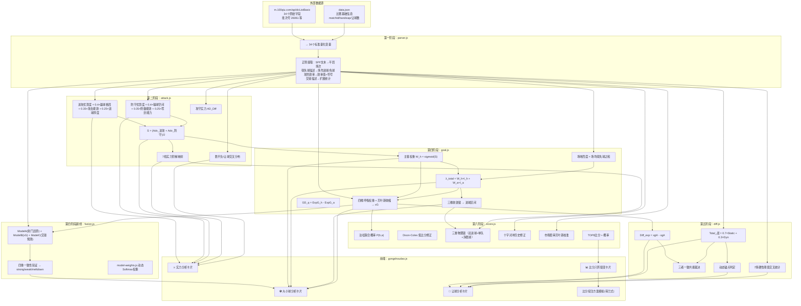

The user wants to understand the data, mapping algorithm, and models used for the 功守道 (GongshouDao) popup. Let me look at the relevant frontend code and backend data structure.
好的，让我追踪功守道弹窗的完整数据链路：前端展示 → 数据组装 → 映射算法 → 底层模型。
Let me read the frontend gongshoudao.js and the development document, then trace back to the backend API.
Now let me read more of the frontend gongshoudao.js to see the full rendering of sections, and then trace back to the backend server code to understand data assembly and mapping algorithms.
Now let me read the actual backend gongshoudao modules - the core algorithm files.
现在看后端核心算法模块：
Good, now I can see the structure. Let me read the core algorithm files to understand the model and mapping.
Now let me read the remaining algorithm modules - goal.js, diff.js, score.js, fusion.js, model-weights.js
Now let me read the remaining modules: score.js (the Poisson matrix), fusion.js, model-weights.js, and how the frontend handles the score betting table.
Now let me also read the model-weights.js and the frontend gongshoudao.js continued (for the score betting table part):
Now I have a comprehensive understanding of the entire Gongshoudao pipeline. Let me now compile a thorough analysis covering:

1. **Popup display data** - the full JSON field to UI mapping
2. **Mapping algorithm** - how m.100qiu.com API fields map to 34 standard variables, then to the 7-stage computation
3. **Models used** - all the mathematical models involved

Let me now present this in a clear structured format.
现在我已经完整追踪了全链路，以下是功守道弹窗的完整分析。

---

## 功守道弹窗：数据 → 映射 → 算法 → 模型 全链路

### 一、数据流转全景



---

### 二、弹窗数据字段 → UI 展示完整映射

#### 1. ⚔️ 实力分析卡片

| 弹窗展示项 | 数据字段 | 来源模块 | 计算公式简述 |
|-----------|---------|---------|-------------|
| 进攻优势 | `attackAdvantage` / `attackAdvantageValue` | `attack.js` | 0.4×赢球格局对冲 + 0.35×攻击能效对冲 + 0.25×进球厚度对冲，归一化到±100% |
| 防守优势 | `defenseAdvantage` / `defenseAdvantageValue` | `attack.js` | 0.4×输球空间对冲 + 0.35×防御能效对冲 + 0.25×失球厚度对冲，归一化到±100% |
| 攻守格局 | `attackPattern` | `attack.js` | 状态机：Adv_进攻>0.15→对攻为主；Adv_防守>0.15→防守为主；否则攻守平衡 |
| 进攻/防守权重 | `attackDimWeight` / `defenseDimWeight` | `attack.js` | w_进攻 = sigmoid(Adv_进攻)；w_防守 = 1 - w_进攻 |
| 综合攻守优势 | `totalAdvantage` / `totalAdvantageValue` | `attack.js` | S = (Adv_进攻 + Adv_防守) / 2 |
| 实力阶梯 | `ladderLabel` / `ladderLevel` | `attack.js` | S≥0.30→主队绝对大优势(3) … S≤-0.30→客队绝对大优势(-3)，共7档 |
| 胜平负交叉 | `crossSpfWin/Draw/Lose` | `attack.js` | 不让球：Cross_win = (H_win + A_loss)/20 |
| 让球交叉 | `crossHcpWin/Draw/Lose` + `crossRq` | `attack.js` | 合并两队20场净胜球分布，按让球数偏移后统计 |

#### 2. ⚽ 大小球分析卡片

| 弹窗展示项 | 数据字段 | 来源模块 | 计算公式简述 |
|-----------|---------|---------|-------------|
| 主客权重 | `homeWeight` / `awayWeight` | `goal.js` | W_h = sigmoid(S)，限幅[0.05, 0.95] |
| 得失球 | `goalDiffHome` / `goalDiffAway` | `goal.js` | 近期场均进球/失球 |
| 总进球期望 | `totalGoalsExpect` / `totalGoalsValue` | `goal.js` | λ_total = W_h×Intensity_home + W_a×Intensity_away |
| 进球区间 | `goalRange.range` | `goal.js` | 三维收敛锁：λ_gene×0.4 + λ_actual×0.3 + λ_total×0.3 |
| 主队预期进球 | `xgHome` | `goal.js` | xgHome = β1×场均进球 + β3×主场进球（贝叶斯收缩） |
| 客队预期进球 | `xgAway` | `goal.js` | xgAway = β2×场均进球 + β4×客场进球（贝叶斯收缩） |
| 四重验证 | `fusionConsensus` / `fusionFinalHome/Away` | `fusion.js` | 三模型一致性判定 → strong/weak/meltdown |

#### 3. 🎯 让球分析（7场阈值裁决）

| 弹窗展示项 | 数据字段 | 来源模块 | 计算公式简述 |
|-----------|---------|---------|-------------|
| 主队赢球期望 | `homeWinExpect` / `homeWinValue` | `diff.js` | Diff_exp = xgHome - xgAway |
| 功守道战力 | `totalAdvantage2` / `totalAdvantage2Value` | `diff.js` | Total_战 = 0.7×Static + 0.3×Dyn_diff |
| 动态锚点 | `anchor.label` | `diff.js` | Total_战≥0.2→主队强势；≤-0.2→客队强势 |
| 输赢球分布 | `goalCount` / `goalCountValue` | `diff.js` | Diff_exp≥0.5→≥1；≤-0.5→≤-1 |
| 7场阈值判定 | `sevenMatch.dimension1.label` | `diff.js` | 主赢∩客输组合是否≥7场 |
| 共振裁决 | `resonance.verdict` | `diff.js` | Diff_exp/Total_战/7场三者一致判定 |

#### 4. 📊 比分八阵裂变（含投注模拟）

| 弹窗展示项 | 数据字段 | 来源模块 | 计算公式简述 |
|-----------|---------|---------|-------------|
| 正兵/奇兵/伏兵 | `scores[]` 按概率+方向分类 | 前端JS | 概率≥12%→正兵；5~12%→奇兵；<5%→伏兵 |
| 比分概率 | `scores[].percent` | `score.js` | 泊松联合×Dixon修正×三重锁×历史×市场校准→归一化 |
| 赔率映射 | `scoreOdds{}` | 前端JS | percent→odds = 1/(p/100) |
| 投注模拟 | 荷兰式均分 | 前端JS | 资金分配 = 总本金×(1/赔率)/Σ(1/赔率) |

---

### 三、API 字段映射 — parser.js 34 维标准变量

```1:121:e:\JC-ZJFA\server\gongshoudao\parser.js
/**
 * 第一阶段：字段解析模块
 * 将 API 原始数据无损映射为 34 个标准量化变量
 */
function parse(raw) {
  // 1. 比分差分布（10维）：homeWinGap_1/2, homeLoseGap_1/2, awayWinGap_1/2, awayLoseGap_1/2
  //    + homeSpf/guestSpf → homeDraw/awayDraw（正则提取平局场次）
  // 2. 进球分布（12维）：homeGoal0/1/2Plus, homeLose0/1/2Plus, awayGoal0/1/2Plus, awayLose0/1/2Plus
  // 3. 场均得失球（8维）：homeFieldGoalAvg/LoseAvg, homeRecentGoalAvg/LoseAvg... 正则提取
  // 4. 攻防效率（8维）：homeAttackEfficiency, homeDefendEfficiency... 含带符号原始值
  // 5. 大球率/实力/赢盘率/赔率/让球/交锋
  // 6. 净胜球序列（homeGoalDiffSeries/awayGoalDiffSeries）
  // 7. 交锋扩展统计（jiaoFenExtended）
}
```

---

### 四、核心数学模型汇总

#### 模型 1：进攻优势度（attack.js）

$$
W_{score} = 2 \times WG_2 + 1 \times WG_1 + 0.5 \times D \quad\text{(赢球格局得分)}
$$

$$
Hedge_{gap} = \frac{W_h - W_a}{10}
$$

$$
AtkEff = \frac{G_{avg}}{Eff_{atk} + 0.001} \quad\text{(攻击能效还原)}
$$

$$
Thick = 1 \times Q_1 + 2 \times Q_{2+} \quad\text{(进球厚度)}
$$

$$
Adv_{进攻} = 0.4 \times Hedge_{gap} + 0.35 \times Hedge_{eff} + 0.25 \times Hedge_{thick}
$$

#### 模型 2：格局状态机

```167:177:e:\JC-ZJFA\server\gongshoudao\attack.js
function calcPattern(attAdv, defAdv) {
  if (attAdv > 0.15 && defAdv > -0.05) return '对攻为主';
  if (defAdv > 0.15 && attAdv > -0.05) return '防守为主';
  return '攻守平衡';
}
```

#### 模型 3：Sigmoid 维度权重

$$
w_{进攻} = \sigma(Adv_{进攻}) = \frac{1}{1 + e^{-Adv_{进攻}}}
$$

#### 模型 4：7 档实力阶梯

```202:210:e:\JC-ZJFA\server\gongshoudao\attack.js
function calcStrengthLadder(S) {
  if (S >= 0.3) return { label: '👑 主队绝对大优势', level: 3 };
  if (S >= 0.15) return { label: '⚔️ 主队中等优势', level: 2 };
  if (S >= 0.05) return { label: '🔍 主队微弱优势', level: 1 };
  if (S > -0.05) return { label: '⚖️ 双方实力接近', level: 0 };
  if (S >= -0.15) return { label: '🔍 客队微弱优势', level: -1 };
  if (S > -0.3) return { label: '⚔️ 客队中等优势', level: -2 };
  return { label: '👑 客队绝对大优势', level: -3 };
}
```

#### 模型 5：xG 四维呼吸权重（goal.js — 核心竞体模型）

$$
atk_H = \frac{G_h}{Eff_{atk,h} + 0.001} \quad\text{(还原主队射门次数)}
$$

$$
\beta_{1,raw} = \frac{atk_H}{atk_H + shotAgainst_A} \quad\text{(原始β)}
$$

$$
\beta_1 = shrinkBeta(\beta_{1,raw}, n) = \frac{n}{n+3} \times \beta_{1,raw} + \frac{3}{n+3} \times 0.5 \quad\text{(贝叶斯收缩)}
$$

$$
xgHome = \beta_{1,adj} \times G_h + \beta_3 \times G_{h,field}
$$

$$
GD_q = ExpG_h - ExpG_a
$$

#### 模型 6：Total_战 — 双轨实力量化（diff.js）

$$
Static = \frac{HomePower - GuestPower}{HomePower + GuestPower}
$$

$$
Dyn = \frac{WG_2\times2 + WG_1\times1.75 + D\times0.5 + LG_1\times0.25}{Dyn_h + Dyn_a}
$$

$$
Total_{战} = 0.7 \times Static + 0.3 \times Dyn_{diff}
$$

#### 模型 7：泊松比分矩阵（score.js — Dixon-Coles 修正）

$$
P(h,a) = Pois(h|\lambda_h) \times Pois(a|\lambda_a) \times \tau_{DC}(h,a)
$$

```67:83:e:\JC-ZJFA\server\gongshoudao\score.js
function dixonColesCorrection(h, a, lambdaH, lambdaA, rho) {
  rho = rho || -0.05;
  if (h === 0 && a === 0) return 1 - lambdaH * lambdaA * rho;
  if (h === 1 && a === 0) return 1 + lambdaH * rho;
  if (h === 0 && a === 1) return 1 + lambdaA * rho;
  if (h === 1 && a === 1) return 1 - rho;
  return 1.0;
}
```

#### 模型 8：三重物理锁软化（Sigmoid 连续衰减替代硬截断）

```
最终概率 = P_poisson × τ_DC × P_cond × P_history × P_power × σ_lock2 × σ_lock3 × P_market
```

#### 模型 9：四重一致性融合与熔断（fusion.js）

| 模型 | 名称 | 核心公式 |
|------|------|---------|
| ModelA | 射门还原法 | E_total = α×Eff_atk,H×10 + (1-α)×Eff_def,A×10 + ... |
| ModelB | 攻守权重法 | xgHome + xgAway (来自 goal.js) |
| ModelC | 交锋预测法 | 0.3×近6次总进球均值 + 0.7×近2次总进球均值 |

一致性判定规则：

```140:168:e:\JC-ZJFA\server\gongshoudao\fusion.js
  if (nConsistent >= 3) {
    finalTotal = round(weightedAvg([0, 1, 2]), F);
    consensusLabel = '强一致(三模型融合)';
    consensusType = 'strong';
  } else if (nConsistent === 2) {
    // 剔除分歧模型，加权平均
    consensusLabel = '弱一致(剔除ModelX)';
    consensusType = 'weak';
  } else {
    // 熔断 — 保留模型加权预测，不跟随盘口
    consensusLabel = '熔断(模型分歧较大)';
    consensusType = 'meltdown';
  }
```

#### 模型 10：动态权重引擎（model-weights.js）

基于近30天各模型命中率，通过 Softmax 温度缩放计算动态权重：

$$
acc_i = \frac{hits_i}{total_i} \quad\text{(缩尾至[0.3, 0.7])}
$$

$$
w_i = \frac{e^{acc_i / T}}{\sum_j e^{acc_j / T}} \quad (T = 0.5)
$$

样本不足20场或模型不可用时回退到等权 `{1/3, 1/3, 1/3}`。

---

### 五、API 响应 → 弹窗一次性调用链路

**前端触发**：用户点击比赛卡片 `⚔️ 功守道量化` 标签

```21:22:e:\JC-ZJFA\preview\js\pages\gongshoudao.js
  api('gongshoudao', { matchId: matchId })
    .then(function (data) {
```

**后端处理**：`server/index.js` 中 `case 'gongshoudao'`

```40:46:e:\JC-ZJFA\server\gongshoudao\index.js
function computeSingleMatch(rawStats, matchInfo) {
  const vars = parser.parse(rawStats);        // 第一阶段：字段解析
  const strengthResult = attack.analyze(vars); // 第二阶段：实力分析
  const goalResult = goal.analyze(vars, S);   // 第四阶段：大小球+xG
  const diffResult = diff.analyze(vars, xgH, xgA); // 第五阶段：让球分析
  // 第六阶段比分在 index.js 组装中调用 score.analyze()
}
```

**返回数据结构**：约 130+ 个字段的 JSON，涵盖所有弹窗展示所需数据。上述6个计算阶段的所有输出字段都在同一个 JSON 对象中返回给前端。

---

### 六、总结

功守道弹窗的数据链路是一套**6阶段量化分析流水线**：

| 阶段 | 模块 | 核心算法 | 输出 |
|------|------|---------|------|
| 1 | `parser.js` | 正则提取 + 34维标准化 | 标准变量集 `vars` |
| 2+3 | `attack.js` | 3子维度合成 + sigmoid权重 + 7档阶梯 | 进攻/防守优势度、实力阶梯、交叉分布 |
| 4 | `goal.js` | 主客权重sigmoid + 场地烈度 + xG四维呼吸 + 贝叶斯收缩 | λ_total、xG、GD_q |
| 4-副 | `fusion.js` | 三模型融合 + 一致性判定 | strong/weak/meltdown |
| 5 | `diff.js` | 双轨量化 Total_战 + 7场交叉统计 + 共振裁决 | Diff_exp、Anchor、7场阈值 |
| 6 | `score.js` | 泊松+Dixon-Coles + 三重Sigmoid软锁 + 历史修正 + 市场贝叶斯校准 | TOP8 比分概率 |
| 权重 | `model-weights.js` | 近30天命中率 Softmax 温度缩放 | wA, wB, wC 动态权重 |

整个系统共使用 **~15 个独立数学模型**，覆盖从实力评估到比分预测的完整量化分析链。