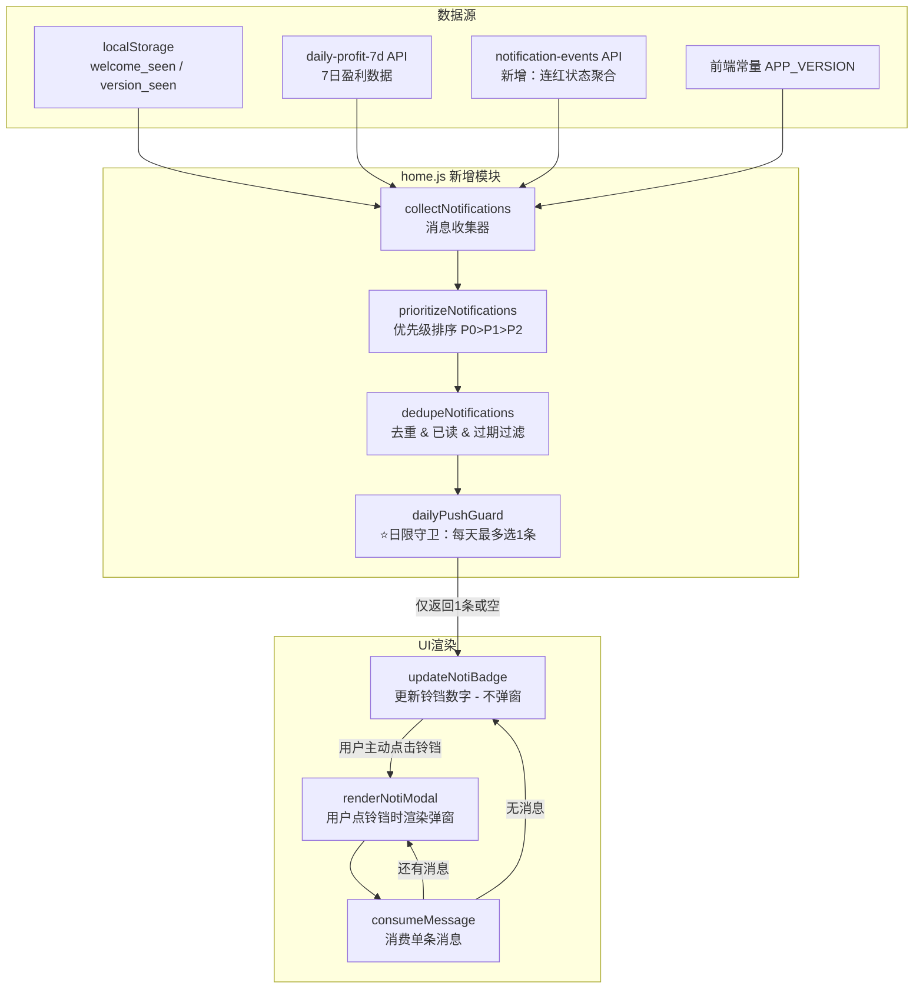

# 消息提醒功能需求文档

> 创建时间：2026-06-10
> 状态：规划完成，待实施
> 优先级：P1
> **核心原则：消息原则上不打扰用户，每天最多推送一条消息**

---

## 一、功能概述

将首页静态铃铛图标升级为**系统消息提醒中心**，支持多类型消息的自动收集、**每日限流选举**、优先级排序、Badge 展示和弹窗逐条关闭交互。

**设计哲学：不打扰 > 信息触达。** 用户不主动查看时，系统只通过铃铛 Badge 数字静默提示，绝不自动弹窗打断操作。

---

## 二、确认的关键决策

### 2.1 "专家博热5连红"判断标准

- **定义**：专家博热方案**当天盈利为正数**，且连续 5 天盈利均为正数
- **数据来源**：`daily-profit-7d` API 返回的每日 profit 字段（需后端新增连红计算逻辑）
- **去重**：同一连红周期只提醒一次

### 2.2 "7天盈利超过1000"判断标准

- **定义**：每个方案按 **1000元** 金额计算的盈利，近 7 天累计 >= 1000 元
- **数据来源**：复用现有 `daily-profit-7d` API，读取 `total` 字段
- **与现有逻辑一致**：同首页盈利图表的计算方式

### 2.3 弹窗尺寸与位置

- **尺寸**：占屏幕高度的 **1/3**
- **位置**：屏幕首屏**居中卡片形式**展示
- **风格**：使用系统统一弹窗风格（Alpine Mint 浅色主题）

### 2.4 消息消费规则

- 有 N 条未读消息时，弹窗显示 N 条
- **点击某条消息的操作按钮 → 该条消失，剩余上移**
- 所有消息消费完毕 → 弹窗自动关闭，Badge 清零
- 点击遮罩层或 ✕ → 关闭弹窗，剩余未读保留（Badge 更新为剩余数）

### 2.5 ⭐ 不打扰核心原则（V2 新增）

本功能的设计红线——**一切以"不打扰用户"为第一优先级**：

| 原则 | 具体规则 |
|------|----------|
| **每日上限一条** | 无论当天触发多少种消息类型，用户最多收到 **1 条**推送（其余降级为静默候选） |
| **Badge 优先，弹窗后置** | 消息收集后仅更新铃铛 Badge 数字；弹窗只在用户**主动点击铃铛**时才展示 |
| **仅在首页检查** | 消息引擎仅在 `home.js` 页面加载时运行，其他页面不触发任何消息逻辑 |
| **禁止自动弹出** | 绝不在页面加载时自动弹出消息弹窗（即使用户有未读） |
| **静默降级** | 未当选为今日推送的消息，仍保留在候选队列中，影响 Badge 数字，但不主动推送到用户视线 |

### 2.6 ⭐ 每日推送选举机制（V2 新增）

#### 选举流程

```
首页加载(home.js)
    │
    ▼
┌─────────────────┐
│ ① 收集候选消息   │ ← collectNotifications()
│   所有触发条件   │   扫描 4 种消息类型
│   满足的均入队   │   生成候选列表
└────────┬────────┘
         │
         ▼
┌─────────────────┐
│ ② 过滤已读/过期  │ ← dedupeNotifications()
│   剔除已消费的   │   localStorage 标记过滤
│   剔除过期的     │   超过有效期的丢弃
└────────┬────────┘
         │
         ▼
┌─────────────────┐
│ ③ 优先级排序     │ ← prioritizeNotifications()
│   P0 > P1 > P2  │   同优先级按时间倒序
└────────┬────────┘
         │
         ▼
┌──────────────────────────────┐
│ ⭐④ 日限守卫（核心新增）      │ ← dailyPushGuard()
│                              │
│ 读取 noti:daily_push_marker: │
│   - 无记录 / 不是今天 →       │
│     取排序后第 1 名作为        │
│     "今日推送消息"，           │
│     写入标记，返回该条          │
│                              │
│   - 已有今天的记录 →           │
│     返回空（今日配额已用完）    │
│     其余全部降级为静候候选      │
└────────┬──────────────────────┘
         │
         ▼
┌─────────────────┐
│ ⑤ 更新 UI       │ ← updateNotiBadge()
│   Badge = 候选数 │   （含已推送 + 静候）
│   不自动弹出！   │   仅等用户点击铃铛
└─────────────────┘
```

#### 优先级总表

| 优先级 | 消息类型 | 说明 |
|--------|----------|------|
| **P0** | 首次欢迎 | 始终排第一（仅首次） |
| **P1** | 专家博热5连红 | 高价值运营事件 |
| **P1** | 7日盈利突破 | 高价值运营事件 |
| **P2** | 系统版本更新 | 低频运维通知 |

> **P1 内部冲突处理**：当同一天同时满足「5连红」和「7日盈利突破」时，按触发时间先后取第一条。两者权重相等，不叠加。

#### daily_push_marker 结构

```javascript
// localStorage key: "noti:daily_push_marker"
{
  date: "2026-06-10",       // 推送日期（用于判断是否同一天）
  pushedId: "streak_20260605", // 今日推送了哪条消息的 ID
  pushedAt: "2026-06-10T02:15:00" // 推送时间戳
}
```

---

## 三、消息类型详细设计

### 3.1 首次欢迎消息（P0 - 最高优先级）

| 属性 | 值 |
|------|-----|
| 触发条件 | `localStorage` 中无 `noti:welcome_seen` 标记 |
| 生成时机 | 首页加载完成后 |
| 优先级 | P0（始终排第一，不受日限约束——因为只有一次） |
| 有效期 | 永久（直到用户操作） |
| 去重 | 用户操作后写入标记，永不再显示 |

**消息内容（已确认）：**

```
🎉 欢迎使用竞彩推荐监控系统！

这里是您的智能方案决策助手：

📊 专家博热方案 — 追踪资深专家的热门推荐方向；
AI深度分析-双AI模型融合，五维分析预测；
AI深度分析-双AI五维分析融合展示；
⚔️ 功守道分析 — 攻守数据建模，预判比赛走势；
🔄 多模型竞争 — 模型PK竞争，提高命中率；

开始探索吧，祝您盈利长红 🍀
```

---

### 3.2 专家博热5连红提醒（P1）

| 属性 | 值 |
|------|-----|
| 触发条件 | 专家博热方案连续 5 天 dailyProfit > 0 |
| 数据来源 | 后端新增 `notification-events` API 或前端聚合多日 `daily-profit-7d` 数据 |
| 优先级 | P1 |
| 有效期 | **3 天**（连红状态可能随时中断，过期后不再提示） |
| 去重 | 同一连红周期只提醒一次（localStorage `noti:streak_{startDate}`）；每日最多入选候选一次 |

**消息内容：**

```
🔥 专家博热 5 连红！

专家博热方案连续 5 天盈利为正，状态极佳：
• {日期1} 日盈利 +{profit1} 元 ✅
• {日期2} 日盈利 +{profit2} 元 ✅
• {日期3} 日盈利 +{profit3} 元 ✅
• {日期4} 日盈利 +{profit4} 元 ✅
• {日期5} 日盈利 +{profit5} 元 ✅
• 5日累计 +{total} 元 🎯

连红势头强劲，查看今日方案跟上节奏 →
```

---

### 3.3 7日盈利突破提醒（P1）

| 属性 | 值 |
|------|-----|
| 触发条件 | 近 7 日累计总盈利 >= 1000 元 |
| 数据来源 | 复用现有 `daily-profit-7d` API 的 total 字段 |
| 优先级 | P1（与连红冲突时按触发时间先后决定谁当选） |
| 有效期 | **1 天**（盈利数据每日更新，昨天的突破提醒在今天可能已不准确） |
| 去重 | 每日最多入选候选一次（localStorage `noti:profit_{date}`）；与连红同日触发时让路于先触发的 |

**消息内容：**

```
💰 专家方案盈利突破！

近 7 日专家博热方案总盈利 +{total} 元 🎯
• 最高单日 +{maxDayProfit} 元（{maxDate}）
• 盈利天数 {winDays}/7 天
• 累计收益率 {yieldRate}%

稳定盈利中，保持跟进 →
```

---

### 3.4 系统重要更新提醒（P2）

| 属性 | 值 |
|------|-----|
| 触发条件 | `localStorage notif:version_seen` 与当前 `APP_VERSION` 不一致 |
| 数据来源 | 前端常量 `APP_VERSION`（如 `"20260610"`），升级时手动递增 |
| 优先级 | P2（最低，通常会让路于 P1） |
| 有效期 | **7 天**（版本更新通知保留一周） |
| 去重 | 每个版本只显示一次 |

**消息内容（模板）：**

```
🆕 系统更新 V{version}

本次更新内容：
✨ {更新项1描述}
📊 {更新项2描述}
🔧 {更新项3描述}

更多细节请继续探索新功能 →
```

---

### 3.5 ⭐ 消息生命周期（V2 新增）

每条消息从生成到消亡经历以下阶段：

```
生成(Trigger) → 候选(Candidate) → 当选(Pushed) / 静候(Waiting) → 消费(Consumed) / 过期(Expired)
     ↑              ↓                ↓                           ↓
   触发条件      进入去重+排序池    日限守卫分配               用户操作 / 超时
                                  仅1条当选                  自动清除标记
```

#### 各阶段行为说明

| 阶段 | 行为 | 示例 |
|------|------|------|
| **生成** | 触发条件满足，消息对象创建 | 连续5天盈利为正 → 创建连红消息 |
| **候选** | 通过去重过滤，进入排序队列 | 不在已读列表中 → 入列 |
| **当选** | 日限守卫选中为今日推送 | 今天还没推送过 → 成为"今日消息" |
| **静候** | 有其他更高优消息当选，本条等待 | 已有连红当选 → 盈利突破进入静候 |
| **消费** | 用户在弹窗中点击操作按钮 | 点击「知道了」→ 消息消失 |
| **过期** | 超过有效期自动失效 | 盈利突破消息超过24h → 下次加载时丢弃 |

#### 关键规则

**规则 1 — 关闭后降级，不重复推送**
- 用户点 ✕ 关闭弹窗但未点击具体消息按钮 → 消息保留在候选队列（Badge 仍然计数）
- 但该消息**不会**在第二天重新参与选举——它已被标记为"本次生命周期的静候态"
- 第二天的选举只看**当天新生成**的消息

**规则 2 — 同类消息合并**
- 同一天内同类消息多次触发 → 只保留最早的那条（去重逻辑已在各类型的 dedupe 键中体现）
- 不同天触发的同类消息 → 各自独立，分别参与当日选举

**规则 3 — Badge 上限**
- Badge 数字 = 当前候选队列中所有**未过期 + 未消费**消息的数量（含当选 + 静候）
- 最大显示值为 **9+**（超过9时显示 `9+` 而非精确数字，避免数字焦虑）

**规则 4 — 过期清理**
- 每次首页加载时，引擎会扫描所有候选消息，将超过有效期的自动移除
- 过期的消息同步清除对应的 localStorage 标记，释放存储空间

#### 有效期汇总表

| 消息类型 | 有效期 | 过期后行为 |
|----------|--------|-----------|
| 首次欢迎 | 永久 | 直到用户手动操作 |
| 5连红 | **3 天** | 自动丢弃，下次连红周期可重新触发 |
| 7日盈利突破 | **1 天** | 次日自动丢弃，可重新触发 |
| 系统更新 | **7 天** | 自动丢弃（一周后用户应已注意到） |

---

## 四、UI / UX 设计

### 4.1 弹窗布局（居中卡片，高度 1/3 屏幕）

> **重要交互约定：弹窗不是自动弹出的！**
> 页面加载时仅更新铃铛 Badge 数字。弹窗只在用户**主动点击铃铛图标**后才渲染并展示。

```
┌──────────────────────────────────────────────────────┐
│                                                       │
│   ┌───────────────────────────────────────────────┐   │
│   │  🔔 消息提醒 (N)                          [✕]  │   │  ← 标题栏
│   │───────────────────────────────────────────────│   │
│   │                                               │   │
│   │  ┌─────────────────────────────────────┐     │   │
│   │  │ 🎉 欢迎使用竞彩推荐监控系统！        │     │   │  ← 卡片1（可独立关闭）
│   │  │ 这里是您的智能方案决策助手...         │     │   │
│   │  │                            [知道了] │     │   │
│   │  └─────────────────────────────────────┘     │   │
│   │                                               │   │
│   │  ┌─────────────────────────────────────┐     │   │
│   │  │ 🔥 专家博热 5 连红！                │     │   │  ← 卡片2
│   │  │ 连续5天盈利为正，状态极佳...         │     │   │
│   │  │                              [查看]  │     │   │
│   │  └─────────────────────────────────────┘     │   │
│   │                                               │   │
│   └───────────────────────────────────────────────┘   │
│                                                       │
│              [ 全部标记已读 ]                          │  ← 底部操作栏
└──────────────────────────────────────────────────────┘
```

### 4.2 交互规则

| 操作 | 行为 |
|------|------|
| **页面加载** | 仅执行消息收集 + Badge 更新，**绝不弹出窗口** |
| **点击铃铛** | 打开弹窗，显示当前候选队列中的所有未消费消息 |
| 点击单条消息按钮 | 该条消失（consumed 动画），剩余上移；若全部消费完则关闭弹窗+清零Badge |
| 点击 ✕ / 遮罩层 | 关闭弹窗，未读消息保留（Badge = 剩余数） |
| 点击「全部标记已读」 | 清除所有消息，关闭弹窗，Badge 归零 |
| 铃铛 Badge | 未读数量 > 0 时显示数字并有脉冲动画；= 0 时隐藏或灰色态 |

### 4.3 铃铛状态

| 状态 | 样式 |
|------|------|
| 有未读 (N > 0) | Badge 显示数字（上限 `9+`）+ CSS 脉冲动画（吸引注意但不打扰） |
| 无未读 (N = 0) | Badge 隐藏或灰色，铃铛无动画 |
| 有今日推送 (N >= 1) | Badge 可加一个淡蓝色小圆点标识「今日有新内容」（可选增强） |

---

## 五、技术架构

### 5.1 数据流



### 5.2 消息引擎伪代码

```javascript
// ===== home.js 中新增的消息引擎模块 =====

const NotiEngine = {
  /** 核心入口：首页加载时调用 */
  async run() {
    const candidates = this.collect();
    const filtered = this.dedupeAndExpire(candidates);
    const sorted = this.prioritize(filtered);
    const pushResult = this.dailyGuard(sorted);  // ⭐ 日限守卫
    this.updateBadge(pushResult);
    // 注意：这里不调用 renderModal() —— 不自动弹窗
  },

  /** 收集所有满足触发条件的消息 */
  collect() {
    const messages = [];
    // 1. 检查首次欢迎
    if (!localStorage.getItem('noti:welcome_seen')) {
      messages.push(this.buildWelcome());
    }
    // 2. 检查连红（需API数据）
    const streakData = await this.fetchStreakData();
    if (streakData.isStreak && !this.isRead('streak', streakData.startDate)) {
      messages.push(this.buildStreak(streakData));
    }
    // 3. 检查盈利突破
    const profitData = await this.fetchProfitData();
    if (profitData.total >= 1000 && !this.isRead('profit', todayStr)) {
      messages.push(this.buildProfit(profitData));
    }
    // 4. 检查版本更新
    if (localStorage.getItem('noti:version_seen') !== APP_VERSION) {
      messages.push(this.buildVersionUpdate());
    }
    return messages;
  },

  /** 去重 + 过期清理 */
  dedupeAndExpire(messages) {
    const now = Date.now();
    return messages.filter(msg => {
      if (msg.consumed) return false;
      if (msg.expiresAt && now > msg.expiresAt) {
        // 清理过期标记
        localStorage.removeItem(msg.storageKey);
        return false;
      }
      return true;
    });
  },

  /** 优先级排序 */
  prioritize(messages) {
    const order = { P0: 0, P1: 1, P2: 2 };
    return messages.sort((a, b) => {
      if (order[a.priority] !== order[b.priority]) {
        return order[a.priority] - order[b.priority];
      }
      // 同优先级按时间倒序（越新的排前面）
      return new Date(b.createdAt) - new Date(a.createdAt);
    });
  },

  /**
   * ⭐ 日限守卫——核心新增方法
   * @param {Array} sortedMessages - 已排序的候选消息
   * @returns {{ pushed: Object|null, waiting: Array }}
   */
  dailyGuard(sortedMessages) {
    const markerStr = localStorage.getItem('noti:daily_push_marker');
    const marker = markerStr ? JSON.parse(markerStr) : null;
    const today = new Date().toISOString().slice(0, 10);

    // 如果今天已经推送过了，全部降级为静候
    if (marker && marker.date === today) {
      return { pushed: null, waiting: sortedMessages };
    }

    // 今天还没推送过 → 取第一名作为今日推送
    const pushed = sortedMessages[0] || null;
    const waiting = sortedMessages.slice(1);

    if (pushed) {
      localStorage.setItem('noti:daily_push_marker', JSON.stringify({
        date: today,
        pushedId: pushed.id,
        pushedAt: new Date().toISOString(),
      }));
    }

    return { pushed, waiting };
  },

  /** 更新 Badge（含静候消息的总数） */
  updateBadge({ pushed, waiting }) {
    const totalCount = (pushed ? 1 : 0) + waiting.length;
    const badgeEl = document.getElementById('notiBadge');
    if (!badgeEl) return;

    if (totalCount <= 0) {
      badgeEl.style.display = 'none';
      badgeEl.textContent = '';
      badgeEl.classList.remove('bell-pulse');
    } else {
      badgeEl.style.display = 'inline-flex';
      badgeEl.textContent = totalCount > 9 ? '9+' : String(totalCount);
      badgeEl.classList.add('bell-pulse');
    }
  },
};
```

### 5.3 localStorage 键设计

| 键名 | 类型 | 说明 |
|------|------|------|
| `noti:welcome_seen` | boolean | 首次欢迎是否已读 |
| `noti:version_seen` | string | 已读的系统版本号 |
| `noti:streak_{startDate}` | string | 连红提醒已读（记录起始日期） |
| `noti:profit_{date}` | string | 当日盈利突破已读 |
| **`noti:daily_push_marker`** | **JSON object** | **⭐ V2 新增：每日推送标记（date + pushedId + pushedAt）** |

---

## 六、涉及文件清单

### 前端修改（必须）

| 文件 | 改动说明 |
|------|----------|
| `preview/index.html` | 铃铛按钮加 `onclick="App.showNotifications()"`，badge 加 `id="notiBadge"` |
| `preview/js/pages/home.js` | **新增消息引擎模块**：收集/排序/去重/**日限守卫**/Badge更新/弹窗渲染/消费 |
| `preview/css/app.css` | 铃铛脉冲动画 `.bell-pulse`、有/无消息状态样式 |
| `preview/css/modals.css` | 新增 `.noti-overlay` / `.noti-modal` 样式（浅色主题，居中卡片） |

### 后端修改（可选 - 方案B）

| 文件 | 改动说明 |
|------|----------|
| `server/index.js` | 新增 `notification-events` API 路由，返回连红状态 + 7日盈利摘要 |

---

## 七、分阶段实施计划

| 阶段 | 内容 | 消息类型 | 复杂度 | 日限机制 |
|------|------|----------|--------|----------|
| **Phase 1** | 弹窗框架 + 铃铛点击交互 + **日限守卫骨架** + 首次欢迎消息 | ① 欢迎 | 低 | **本阶段必须包含**（后续阶段复用） |
| **Phase 2** | 系统版本更新提醒（纯 localStorage） | ④ 版本更新 | low | 复用 Phase 1 的日限 |
| **Phase 3** | 7日盈利突破提醒（复用已有 API）+ **有效期/过期逻辑** | ③ 盈利突破 | 中 | 复用 Phase 1 的日限 |
| **Phase 4** | 5连红提醒（需后端新增 API 或多日查询） | ② 连红 | 中高 | 复用 Phase 1 的日限 |

> **关键变更**：原计划日限机制放在 Phase 4，现调整为 **Phase 1 必须包含**。原因是日限守卫是整个消息引擎的核心骨架，没有它 Phase 2-3 的消息就无法遵守"每天最多一条"的原则。

---

## 八、弹窗样式规范

基于现有系统统一弹窗风格（Alpine Mint 浅色主题）：

```css
/* 弹窗遮罩 - 与 del-overlay/share-overlay 一致 */
.noti-overlay {
  position: fixed; inset: 0;
  background: rgba(0, 0, 0, 0.45);
  z-index: 900;
  display: flex;
  align-items: center;       /* 垂直居中 */
  justify-content: center;    /* 水平居中 */
}

/* 弹窗主体 - 高度约 1/3 屏幕 */
.noti-modal {
  width: min(520px, 90vw);
  max-height: 33.33vh;        /* 屏幕高度的 1/3 */
  background: #ffffff;
  border-radius: 16px;
  box-shadow: 0 20px 60px rgba(0,0,0,0.15);
  display: flex;
  flex-direction: column;
  overflow: hidden;
  animation: notiSlideUp 0.3s ease-out;
}

/* 单条消息卡片 */
.noti-card {
  padding: 14px 16px;
  border-bottom: 1px solid #f0f0f0;
  transition: all 0.25s ease;
}

.noti-card.consumed {
  opacity: 0;
  transform: translateX(20px);
  height: 0;
  padding: 0;
  margin: 0;
  overflow: hidden;
}

/* 铃铛脉冲动画 - 吸引注意但不打扰 */
@keyframes bellPulse {
  0%, 100% { transform: scale(1); }
  50% { transform: scale(1.15); }
}

.bell-pulse {
  animation: bellPulse 2s ease-in-out infinite;
}

/* 今日推送标识（可选增强）：Badge旁的小圆点 */
.noti-badge-dot {
  display: inline-block;
  width: 6px;
  height: 6px;
  border-radius: 50%;
  background: #3B82F6;
  margin-left: 4px;
  animation: bellPulse 1.5s ease-in-out infinite;
}
```

---

## 九、验收标准

### 基础功能验收

- [ ] 首次访问用户看到欢迎消息（**点击铃铛后**弹出，不是自动弹出）
- [ ] 铃铛 badge 数字准确反映未读消息数量（上限显示 `9+`）
- [ ] 有未读时铃铛有脉冲动画，无未读时静默
- [ ] 点击铃铛弹出居中卡片弹窗（高度约 1/3 屏幕）
- [ ] 多条消息可逐条点击关闭，每关一条剩余消息平滑上移
- [ ] 全部消息消费完毕后弹窗自动关闭，Badge 归零

### ⭐ 不打扰原则验收（V2 核心）

- [ ] **页面加载时不自动弹出任何消息弹窗**（即使有多条未读）
- [ ] **每天最多推送一条消息**：模拟同一天触发连红+盈利突破+版本更新，验证只展示优先级最高的那一条
- [ ] **次日再次访问时**，前一天的静候消息不重复参与选举（除非当天重新触发）
- [ ] **消息过期后自动消失**：修改系统时间使盈利突破消息超过 24h，验证其从候选队列中被清除
- [ ] **仅在首页触发**：切换到方案页/比赛详情页后再切回首页，确认消息引擎只在首页加载时运行

### 业务消息验收

- [ ] 7日盈利>=1000时触发盈利突破提醒（每日最多一次，有效期1天）
- [ ] 连续5天正盈利时触发连红提醒（每周期一次，有效期3天）
- [ ] 系统升级后首次打开显示更新通知（每个版本一次，有效期7天）

### 样式验收

- [ ] 弹窗样式与系统其他弹窗风格一致（浅色圆角阴影）
- [ ] Badge 超过 9 条时显示 `9+` 而非大数字

---

## 十、风险与边界情况

| 场景 | 预期行为 |
|------|----------|
| 用户清除了浏览器 localStorage | 所有已读标记丢失，消息会重新触发（等同于新用户） |
| 用户一天内打开页面 10 次 | 第 1 次正常选举+推送；后续 9 次读取到当日的 `daily_push_marker`，不再重复推送 |
| 连红期间（已推送连红消息）盈利也突破了 1000 | 连红已占用今日配额，盈利突破降级为静候（明天可参选） |
| 连红在第 6 天中断 | 已推送的连红消息不过期（3天内有效），但用户可通过"全部标记已读"手动清除 |
| API 请求失败（网络异常） | 消息引擎跳过依赖 API 的消息类型（连红/盈利突破），不影响本地类型（欢迎/版本更新）的处理 |
| 同时在多个浏览器标签页打开 | 每个 tab 独立运行消息引擎，localStorage 共享会导致后打开的 tab 读到先打开 tab 写入的标记（这是预期行为） |
